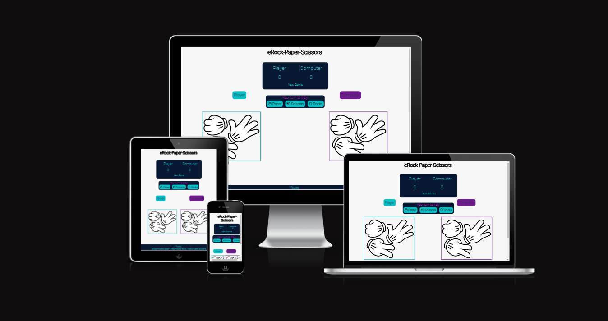
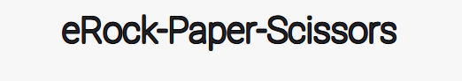
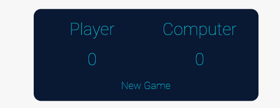
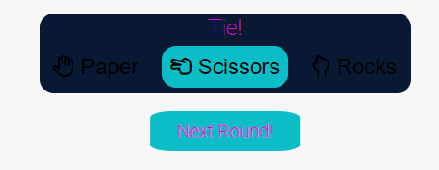
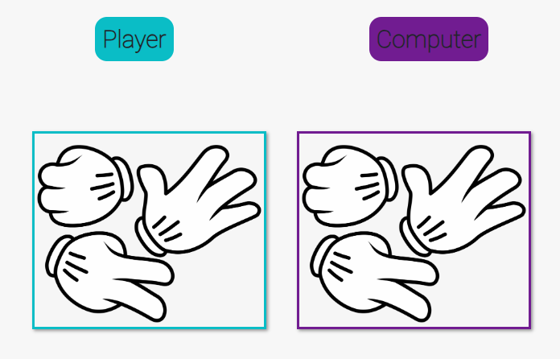
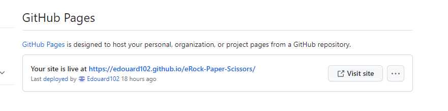
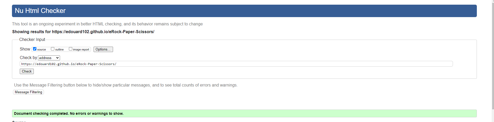
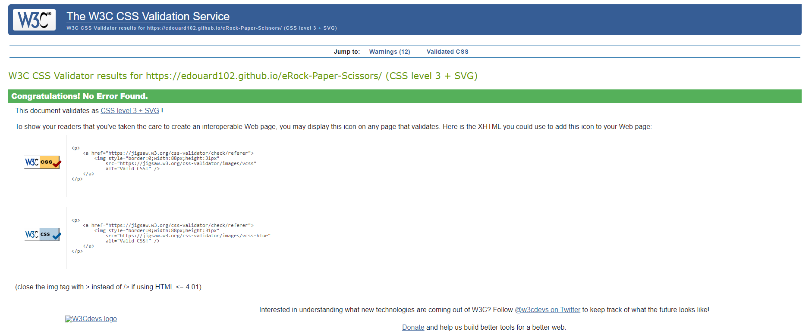

`python3 -m http.server`

# **eRock-Paper-Scissors**

https://ui.dev/amiresponsive?url=https://edouard102.github.io/eRock-Paper-Scissors/
Check out the other mockup:

- ["PAGE NAME"](assets/images/README-images/mockup/ami-responsive-"PAGE NAME".png)

#### Visit the live Website : **https://edouard102.github.io/eRock-Paper-Scissors/**.

# Project

### Project Goals

Immerse yourself in the virtual world of digital battle with eRock-Paper-Scissors! Face off against computer opponents in a classic game.

### User Goals

- Play a game
- Relaxe and have fun

# UX

### **Audience Definition**

The targeted audience is international with an age range of 11 or 12 years old and above. This audience is either children, or adults that are interested in classic game.

### **User Stories**

1. As a first time user :

   - I want the website to be appealing.
   - the navigation to be easy and intuitive.
   - I want to understand immediately what is the website about without the need of looking for it.

2. As a returning user :
   - Challenge myself on the game.

### **Design Choices**

#### Fonts

Considering the targeted audience the fonts chosen for the websites are Roboto.

- Roboto
  It is a sans serif font that is often used in interfaces and digital applications. It has a modern and clean look.

#### Icons

- FontAwesome icons will be used for better user experience.

#### Colors

Cyberpunk color palette: Mix dark and deep colors like black, purple, deep blue and dark pink to create a futuristic and mysterious atmosphere.

#### Images

Images will be used for illustration purposes.

- Rock
- Paper
- Scissors

#### Styling and Feeling

The website is a gaming platform. It uses simple colours to provide the feeling of easy accessibility.
It presents a clean, playful, welcoming and trustworthy feel in order to bring quality information.

# Features

#### Home

- The home page is composed of the main title: “eRock-Paper-Scissors”. This welcome and invites users to discover the website and set the mood and feel of the website.

#### header

- Wil display the title of the web site “eRock-Paper-Scissors”

#### body

- the body will be displayed on 3 parts with the score, the control (choice of the player) and the game (choice made by the player and the computer)

## score area

- This section will allow the user to follow the score. And reset the game.

## control area

 - This section will allow the user to play the game. The user will be able to easily see icons to make the choice to play the game.

## the game

#### footer

- the footer will diplays the rules of the game.

### **Features to Implement in the Future Versions**

#### FEATURES TO BE ADDED

- extension of the game with big bang theory version
- add music
- Contact
- copyright

# Technologies Used

### Programing Languages

This project uses HTML, CSS and JavaScript.

### Frameworks, Libraries and Programs

- [Google Fonts](https://fonts.google.com/)  
  For importing fonts (**_FONT NAME_** and **_FONT NAME_**) into the style.css file.

- [Fontawesome](https://fontawesome.com/icons?d=gallery)  
  For using icons throughout the website.

- [codeanywhere](https://app.codeanywhere.com/)  
  For Integrated Development Environment.

- * [GitPod](https://www.gitpod.io/)  
  For Integrated Development Environment.

- [GitHub](https://github.com/)  
  For storing the repository.

- [GitHub Pages](https://pages.github.com/)  
  For deploying the website live.

# Deployment
To make this website accessible to the public, Walking Around 
has been deployed on [GitHub Pages](https://pages.github.com/) as follow :

1. Log in to my GitHub account.
    *  You need to sign up on your account[GitHub](https://github.com/).

2. Go to my **Repositories** and select the repository corresponding :[eRock-Paper-Scissors](https://github.com/Edouard102/eRock-Paper-Scissors).

3. Navigate to **Settings** :

4. Scroll down to the **GitHub Pages** section.
5. Click on the **None** dropdown menu and select the branch to publish : **master**.
6. Click on **Save**.
7. The website is now deployed.

The link to the website is found in the **GitHub Pages** section of the repository settings.

# Testing

I have tried the site on several browsers and it works correctly.

- Safari
- Google Chrome
- Microsft Edge
- Firefox

# Validator testing

- HTML

No errors were found when passing through the official [(Jigsaw) validator]

- CSS

No errors were returned when passing through the official [W3C validator]

- JavaScript

No errors were found when passing through the official [Jshint validator]

- The following metrics were returned: 
      - There are 16 functions in this file.

      - Function with the largest signature take 2 arguments, while the median is 1.

      - Largest function has 17 statements in it, while the median is 2.

      - The most complex function has a cyclomatic complexity value of 8 while the median is 1.

# Bugs

### Solved

Issue : undefined in playRound function:

Solution : remove the call new game function from the reset function.

The reasons: The playround function uses an event to select the click button from the player during a game and calling this function during a reset created the bug, as it is not a game but simply a reset.

# Credit

### Content :

[W3schools](https://www.w3schools.com/)  
For general database on software development.

[Hostinger Tutorials](https://www.hostinger.com/tutorials/how-to-add-favicon-to-website)  
Provided the link and explanation on how to install the favicon for the website.

[George Dimitriadis](https://stackoverflow.com/questions/23968961/css-how-can-i-make-a-font-readable-over-any-color)  
For text-shadow tricks used in css to make text more readable.

[GeeksforGeeks](https://www.geeksforgeeks.org/how-to-vertically-center-text-with-css/)  
For tips on vertical alignment in CSS.

[USERWAY](https://userway.org/blog/html-required-versus-aria-required)  
For explanation on best use of the required attribute.

[coder coder!](https://coder-coder.com/background-image-opacity/#:~:text=There's%20no%20CSS%20property%20that,for%20the%20background%2Dimage%20property.)
For explanation and code snippet on overlay on background image used in css.

### Media

##### Images :

The images used on the website are taken from an open source site.

### Aknowledgements :

Special thanks to all Code Institute's team ("Teacher", Lecturers and Tutors) that are making me more knowledgeable and are making this happen.

Huge thank you to the [Slack](code-institute-room.slack.com) community, its all the members and all the leads and tutors for their help and support.

Thanks to my mentor Precious_Mentor for guiding me through this project.
